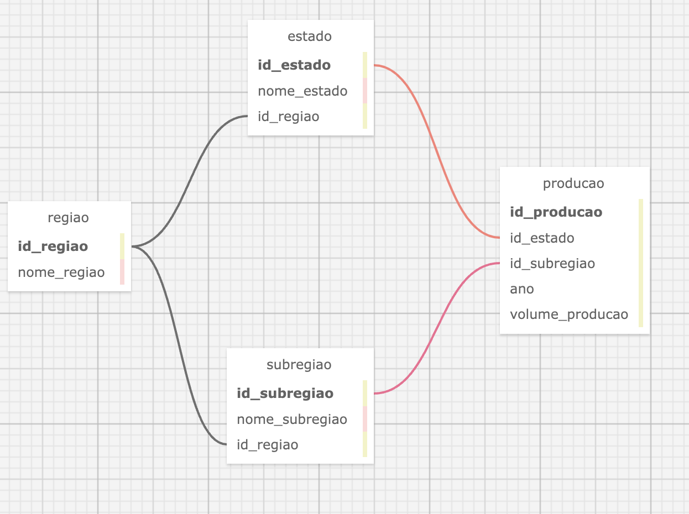

# FIAP - Faculdade de Informática e Administração Paulista

<p align="center">
<a href="https://www.fiap.com.br/"></a>
</p>

<br>

# Analise História do Café Total (Arábica e Conilon)

# Grupo 30

## 👨‍🎓 Integrantes: 
- <a href="https://www.linkedin.com/in/edu-ramos/">Eduardo Ramos</a>

## 👩‍🏫 Professores:

### Tutor(a)

- Lucas

### Coordenador(a)

- André

## 📜 Descrição

Este projeto tem como objetivo analisar a série histórica de produção de café (arábica e conilon) no Brasil, utilizando dados disponibilizados pela Companhia Nacional de Abastecimento (CONAB). O projeto envolve a criação de um modelo de banco de dados normalizado para armazenar esses dados de forma estruturada e eficiente, além de realizar consultas SQL para obter insights relevantes sobre a produção de café no país.

### Etapas do Projeto
1. Pesquisa e Coleta de Dados:

- Os dados utilizados neste projeto foram obtidos do site da CONAB, especificamente da série histórica de produção de café (arábica e conilon) por estado e região.
- Link para os dados: [Série Histórica das Safras - Café Total](https://www.conab.gov.br/info-agro/safras/serie-historica-das-safras/itemlist/category/895-cafe-total-arabica-e-conilon)

2. Análise dos Dados:

- Os dados foram analisados para identificar as principais entidades, atributos e relacionamentos.
- As principais entidades identificadas foram: `Região`, `Estado`, `Sub-região` e `Produção`.

3. Modelo Entidade-Relacionamento (MER):
- Foi criado um diagrama entidade-relacionamento para representar as entidades e seus relacionamentos.
- Entidades:
  - `Região`: Representa as regiões do Brasil.
  - `Estado`: Representa os estados brasileiros.
  - `Sub-região`: Representa sub-regiões dentro dos estados.
  - `Produção`: Representa os dados de produção de café.

4. Normalização:

- Aplicamos as regras de normalização (1FN, 2FN e 3FN) para refinar o modelo e eliminar redundâncias e anomalias.
- O modelo foi dividido em três tabelas principais: `regiao`, `estado` e `subregiao`, com a tabela `producao` referenciando essas tabelas.

5. Modelo Lógico Relacional:

- O modelo conceitual normalizado foi convertido para um modelo lógico relacional.
- Diagrama do modelo relacional foi criado para representar as tabelas e seus relacionamentos.



6. Criação das Tabelas:

- Código SQL foi gerado para criar as tabelas do banco de dados, definindo chaves primárias, chaves estrangeiras e restrições de integridade.

## 📁 Estrutura de Pastas

Dentre os arquivos e pastas presentes na raiz do projeto, definem-se:

- **src**: Contém o script Python que utiliza a biblioteca Pandas para a limpeza e transformação dos dados.
  - `data_cleaning.py` => Script para carregar, limpar e transformar os dados da planilha CSV.

- **sql**: Scripts SQL para criação e manipulação do banco de dados.
  - `banco.sql` => Script para criação do banco de dados e das tabelas de regiões, estados e sub-regiões.
  - `inserts.sql` => Script para inserção dos dados de produção nas tabelas.
  - `queries.sql` => Script com consultas SQL para análise dos dados.

- **README.md**: Arquivo que serve como guia e explicação geral sobre o projeto (o mesmo que você está lendo agora).

- **assets**: Contém os assets, planilhas e dados utilizados neste projeto.
  - `dados.csv` => Planilha CSV com os dados de produção de café.

- **docs**: Documentação da modelagem do projeto.

## 🔧 Como Executar o Projeto

Siga os passos abaixo para executar o projeto em seu ambiente:

### Pré-requisitos

- **Python 3** instalado.
- Bibliotecas Python:
  - `pandas`
- **Banco de Dados SQL**: Pode ser local ou em nuvem.

### Passo a Passo

1. **Clone o repositório:**

   ```bash
   git clone https://github.com/eduduardo/projeto-fase-03-cap-10.git
   ```

2. Acesse a pasta do projeto:

3. Configurar o Banco de Dados:

- Certifique-se de que o banco de dados SQL está instalado e em execução.
- Importe os dados no banco de dados na seguinte ordem:
  1. banco.sql
  2. inserts.sql

4. Rode as queries para a analise do banco de dados.

5. Caso queira rodar novamente a limpeza dos dados, siga os próximos passos:

6. Instalar dependências Python:
6.1 Instale as bibliotecas necessárias com o pip:
```
pip install pandas
```

6.2. Executar o Script Python:

- Na pasta `src`, execute o script:
```
python data_cleaning.py
```

## Dicionário de Dados
Tabela `regiao`
- id_regiao: Identificador único da região (INT, PK)
- nome_regiao: Nome da região (VARCHAR)

Tabela `estado`
- id_estado: Identificador único do estado (INT, PK)
- nome_estado: Nome do estado (VARCHAR)
- id_regiao: Identificador da região correspondente (INT, FK)

Tabela `subregiao`
- id_subregiao: Identificador único da sub-região (INT, PK)
- nome_subregiao: Nome da sub-região (VARCHAR)
- id_regiao: Identificador da região correspondente (INT, FK)

Tabela `producao`
id_producao: Identificador único da produção (INT, PK)
id_estado: Identificador do estado correspondente (INT, FK, NULL)
id_subregiao: Identificador da sub-região correspondente (INT, FK, NULL)
ano: Ano da produção (INT)
volume_producao: Volume produzido em mil sacas (DECIMAL)

## 🗃 Histórico de lançamentos

* 0.1.0 *  - 03/11/2024

## 📋 Licença

<p xmlns:cc="http://creativecommons.org/ns#" xmlns:dct="http://purl.org/dc/terms/"><a property="dct:title" rel="cc:attributionURL" href="https://github.com/agodoi/template">MODELO GIT FIAP</a> por <a rel="cc:attributionURL dct:creator" property="cc:attributionName" href="https://fiap.com.br">Fiap</a> está licenciado sobre <a href="http://creativecommons.org/licenses/by/4.0/?ref=chooser-v1" target="_blank" rel="license noopener noreferrer" style="display:inline-block;">Attribution 4.0 International</a>.</p>

